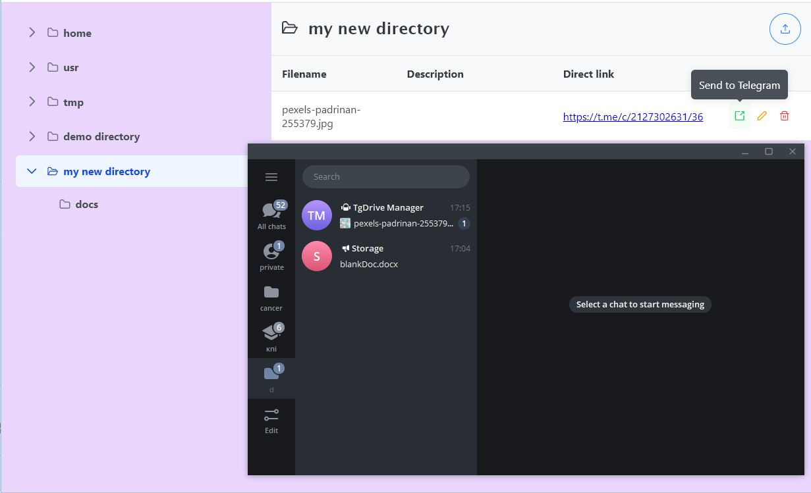

# Tg-Drive
 The system is an integrated software product that provides management, organization, and access to data stored in Telegram. The project consists of two main components: the server side, which is responsible for implementing business logic, interacting with the Telegram API, and processing requests, and the client side, which is a SPA web application.

## Built With/Requirements
### Server side:
[.NET](https://dotnet.microsoft.com/en-us/) | [MySQL](https://www.mysql.com/) | [LiteDB](https://www.litedb.org/) | [RabbitMQ](https://www.rabbitmq.com/) 

### Client side:

[Angular](https://angular.dev/) | [Nginx](https://nginx.org/en/) | [Bootstrap](https://getbootstrap.com/) | [PrimeNG](https://primeng.org/) | [SCSS](https://sass-lang.com/) 

---
[Docker](https://www.docker.com/) (version 25.0.3 and later) with the Docker Compose extension.

## Getting Started
```
cd <repository_folder> 
```
in ```./config/env/tgdrive_host.env``` and ```./config/env/tgdrive_webapi.env``` replace ```TGDRIVE_BOT_TOKEN``` with your Telegram-bot token.

### Windows
``` 
start.bat --a --build
```
Optional Flags: 
- ```--clean```: Clears existing certificates and regenerates them. 
- ```--build```: Forces a rebuild of all Docker containers.
### Linux
``` 
chmod +x start.sh
a./start.sh --a --build
```
Optional Flags: 
- ```--clean```: Clears existing certificates and regenerates them. 
- ```--build```: Forces a rebuild of all Docker containers.

___
Start your Telegram-bot with command ```/start```.

To configure storage in Telegram, create a private channel and forward a message from this channel to the bot.

Access the web application locally at https://tgdrive.com.

# Examples of Usage

## Telegram-bot:

- **Create a new directory in the root folder:**

    

- **Upload a file to a directory and view its location in a pre-configured Telegram channel:**

    

- **Create a child directory and upload the file**  
  (All file extensions allowed by Telegram are supported):

    

There are also buttons for navigating the file system, editing and deleting files and directories.

## Web application:

- **Log in to the application using a Telegram account:**

    


The web application replicates all the functionality available in the Telegram bot.

- **Operations on directories are available:**

    
- However, the web application provides a more comfortable and user-friendly **display of the directory hierarchy**:

    

- **Display directory content** and the function of sending a file to private messages in Telegram  
  (*Send to Telegram*):

  

- The **Direct Link** feature redirects the user to the location of the file in Telegram storage:

    